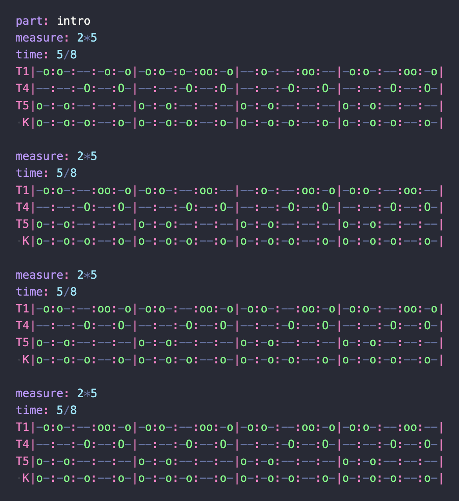

<br/>
<br/>
<br/>
<br/>
<br/>
<br/>
<br/>

<h3 align='center'>@cluesurf/beat</h3>
<p align='center'>
  TypeScript MIDI engine for drum tabs. Drives Logic Pro → Superior
  Drummer 3 via the macOS IAC virtual MIDI bus.
</p>

<br/>
<br/>
<br/>

## Introduction



Pro music tools sound real because real drummers don't play to grid:
every hit moves a few milliseconds, every velocity drifts. **This repo
is a plain-text drum-tab format that compiles to humanized MIDI** and
streams it into Logic (or any DAW) over a virtual MIDI bus. You write
some [simple tabs](./note/tab/drum.md), save the `something.beat` file,
and Superior Drummer plays it back through your kit: with timing jitter,
velocity ranges, swing, flams and accents already baked in.

## Quickstart

First, follow [`note/begin.md`](./note/begin.md) once to enable the
macOS IAC virtual MIDI port and load Superior Drummer 3 in Logic. Then:

```bash
npm install -g @cluesurf/beat
```

Save this as `calm.beat`:

```beat
instrument: drumkit
tempo: 88
humanize: subtle

measure: 4*4
C|X---:----:----:----|
H|x-x-:x-x-:x-x-:x-x-|
S|----:x---:----:x---|
K|x---:--x-:--x-:----|
```

Run it:

```bash
beat ./calm.beat
```

It loops forever, reloads on save, and plays through Logic. Hit Ctrl-C
to stop.

## Programmatic API

Same engine, called from your own TypeScript:

```ts
import { readFileSync } from 'node:fs'
import { parse, play } from '@cluesurf/beat'

const beat = parse(readFileSync('./calm.beat', 'utf8'))
const handle = play(beat.song, { loop: true })

// later:
handle.stop()
await handle.promise
```

`parse(text)` returns `{ song, hits, config, errors }` — the parsed Song
plus any non-fatal parse warnings. `play(song, opts?)` returns
`{ promise, stop }`. See [`code/index.ts`](./code/index.ts) for the full
surface (`humanize`, `expandSong`, `exportSongToMidi`, `NOTE`, etc.).

## What's in here

```
beat/
├── code/             # the engine (parser, scheduler, MIDI export, humanize)
├── test/             # songs (each in text.beat / code.ts / data.ts forms)
├── text/             # the .beat VS Code syntax-highlighter extension
├── note/             # docs (spec, drum defaults, roadmap, syntax, etc.)
├── package.json
├── pnpm-workspace.yaml
├── tsconfig.json
└── vitest.config.ts
```

## Examples

Test songs live at `test/<name>/` and may exist in three equivalent
representations:

| File        | What it is                                                                                               |
| ----------- | -------------------------------------------------------------------------------------------------------- |
| `text.beat` | Text drum tab: see [`note/tab/spec.md`](./note/tab/spec.md) and [`note/tab/drum.md`](./note/tab/drum.md) |
| `code.ts`   | Imperative TypeScript DSL (NOTE constants)                                                               |
| `data.ts`   | Pure data (raw MIDI note numbers)                                                                        |

`pnpm play <name>` picks the first format it finds (`text.beat` first by
default). Override with `--format beat | code | data | text`.

```beat
# test/basic/text.beat
instrument: drumkit
tempo: 100

measure: 4*4
H|x-x-:x-x-:x-x-:x-x-|
S|----:x---:----:x---|
K|x---:----:x---:----|
```

## Running

Prerequisite: macOS IAC bus configured + Logic Pro listening. Full setup
at [`note/begin.md`](./note/begin.md).

```bash
pnpm list:ports                              # verify "TS Drum Engine" port
pnpm try                                     # quick sanity hit
pnpm play                                    # default song
pnpm play tool/grudge                        # play a specific song
pnpm play tool/grudge --part bridge-2        # specific part
pnpm play tool/grudge --pattern bar-007      # solo one bar
pnpm play tool/grudge --from 17 --to 32      # play a region
pnpm play tool/grudge --humanize loose       # drag + jitter
pnpm export tool/grudge                      # write a .mid file
```

## Syntax highlighter

The VS Code extension lives in [`text/`](./text). Top-level scripts:

```bash
pnpm text:make    # build the .vsix
pnpm text:load    # build + install into VS Code
pnpm text:login   # vsce login cluesurf (one-time)
pnpm text:host    # publish to the marketplace
```

See [`note/syntax.md`](./note/syntax.md) for the full layout, scope
table, and dev loop.

## Tests

```bash
pnpm exec vitest run             # 31 tests covering the tab parser
```

## Docs

- [`note/tab/spec.md`](./note/tab/spec.md): generic tab format spec
- [`note/tab/drum.md`](./note/tab/drum.md): drumkit defaults
- [`note/superior-drummer-control.md`](./note/superior-drummer-control.md)
  : what SD3 lets us program
- [`note/tool-drum-sound.md`](./note/tool-drum-sound.md): Tool-style SD3
  setup
- [`note/syntax.md`](./note/syntax.md): `.beat` syntax highlighter
- [`note/roadmap.md`](./note/roadmap.md): what's next

## License

MIT

## ClueSurf

Made by [ClueSurf](https://clue.surf), meditating on the universe ¤.
Follow the work on [YouTube](https://youtube.com/@cluesurf),
[X](https://x.com/cluesurf),
[Instagram](https://instagram.com/cluesurf),
[Substack](https://cluesurf.substack.com),
[Facebook](https://facebook.com/cluesurf), and
[LinkedIn](https://linkedin.com/company/cluesurf), and browse more of
our open-source work here on [GitHub](https://github.com/cluesurf).
